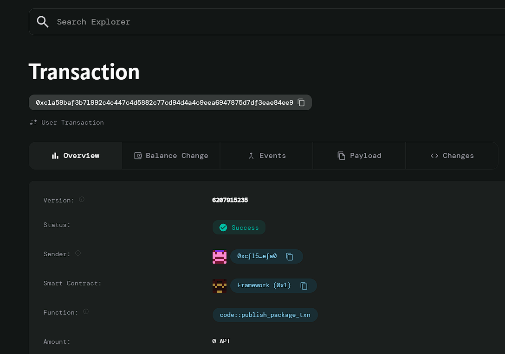

#Employee Payroll System

# Deployed ID: 0xc1a59baf3b71992c4c447c4d5882c77cd94d4a4c9eea6947875d7df3eae84ee9

## Project Description
The Employee Payroll System is a smart contract designed to automate payroll processing for businesses. The system ensures that employees are paid on time and in full, considering variables such as base salary, bonuses, and tax deductions. This smart contract helps businesses streamline payroll management, reduce errors, and comply with labor regulations.

## Project Vision
The vision of this project is to leverage blockchain technology to simplify payroll processing, ensuring employees are compensated accurately and promptly. By automating payroll tasks such as salary distribution, bonus handling, and tax deductions, this system enables businesses to focus more on growth and innovation, while also ensuring full compliance with labor laws.

## Key Features
- **Employee Registration**: Businesses can register employees, specifying their base salary, bonus, and tax deductions.
- **Payroll Processing**: The smart contract automates payroll calculation by adding salary, bonuses, and subtracting taxes, ensuring employees receive the correct amount.
- **Timely Payments**: The system facilitates timely and accurate salary payments, reducing manual errors and delays.
- **Compliance**: The contract ensures payroll processes are transparent and auditable, helping businesses comply with labor regulations.
